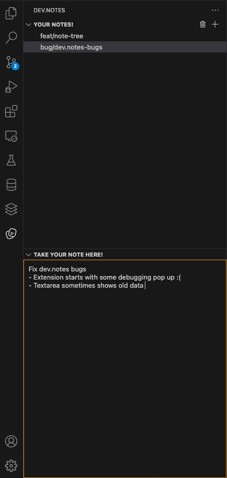

# Dev.Notes

💡 Take quick, powerful dev notes—right from your VS Code sidebar.

📝 Auto-saved and synced every time you close your editor.

## Release Notes

### 1.0.0

Initial release of Dev.Notes

Features:

- Quick notes from the sidebar!
- Support multiple notes
- Textarea for jotting down your note in more detail
- Quick delete/clear all notes

## Upcoming features

- [ ] Single note deletion
- [ ] Sub-notes/folder structure
- [ ] Git integration for note by project
